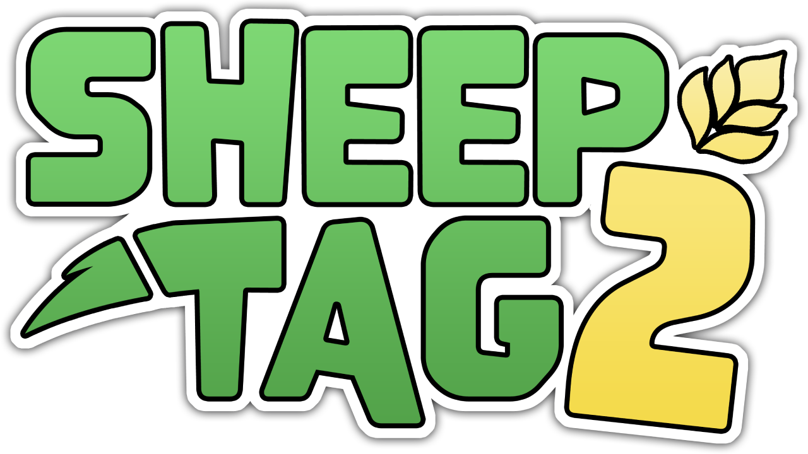

  

<b>The classic cat-and-mouse game — Sheep vs. Wolves.</b> 
A unique blend of real-time strategy and survival. Party with up to 16 players online.

  <a href="https://store.steampowered.com/app/537680/Sheep_Tag_2"><b>⭐ Wishlist on Steam</b></a> &nbsp;·&nbsp;
  <a href="https://www.sheeptag2.com/">🌐 Website</a> &nbsp;·&nbsp;
  <a href="https://discord.gg/jNf5RsaZPp">💬 Discord</a> &nbsp;·&nbsp;
  <a href="https://www.kickstarter.com/projects/lunawolfstudios/sheep-tag-2">🚀 Kickstarter</a>

---

## About this repository

This is the home of the **official [Sheep Tag 2](https://www.sheeptag2.com/) website** and its community **Terrain Content Library**.

**The classic cat-and-mouse game!** It's Sheep against Wolves in this unique blend of real-time strategy and survival. Sheep Tag 2 will put your reflexes to the test in this thrilling and competitive experience bound to keep you on the edge of your seat. Party with up to 16 players online.

Everything the website shows — the terrains you can browse and download, and the farm guide — lives in this repo, so the community can add to it.

## Official links

| | |
|---|---|
| 🌐 Website | https://www.sheeptag2.com/ |
| ⭐ Steam (wishlist!) | https://store.steampowered.com/app/537680/Sheep_Tag_2 |
| 🎵 Soundtrack | https://store.steampowered.com/app/2151350/Sheep_Tag_2_Original_Soundtrack |
| 🚀 Kickstarter | https://www.kickstarter.com/projects/lunawolfstudios/sheep-tag-2 |
| 💬 Discord | https://discord.gg/jNf5RsaZPp |
| 𝕏 (Twitter) | https://x.com/sheeptag2 |
| 📘 Facebook | https://facebook.com/sheeptag2 |
| 📸 Instagram | https://instagram.com/sheeptag2 |
| ▶️ YouTube | https://www.youtube.com/channel/UCzw57oNyk0mCeVSoi-UCUBQ |
| 🎮 Twitch | https://twitch.tv/directory/game/Sheep%20Tag%202 |
| 🕹️ IndieDB | https://www.indiedb.com/games/sheep-tag-2 |

## 🗺️ Terrains

Terrains are the maps you play on. You can **browse and download** every community terrain on the website's [Terrains page](https://www.sheeptag2.com/terrains) — each one shows its map preview, author, size, version, and description.

### Where to put a terrain you downloaded

Drop the downloaded `.json` file into your Sheep Tag 2 **custom** folder, then it'll show up in-game. The folder is different per operating system:

- **Windows** — `%USERPROFILE%\AppData\LocalLow\Luna Wolf Studios\Sheep Tag 2\Custom\`
- **macOS** — `~/Library/Application Support/Luna Wolf Studios/Sheep Tag 2/Custom/`
- **Linux** — `~/.config/unity3d/Luna Wolf Studios/Sheep Tag 2/Custom/`

> Tip: on Windows the `AppData` folder and on macOS the `Library` folder are hidden by default — you may need to enable "show hidden files" to see them.

### Submitting your own terrain

Made a terrain you're proud of? Share it with everyone through the **[terrain submission form](https://www.sheeptag2.com/submit)** — no account needed. Your terrain is validated automatically in the browser (metadata, preview image, map data) before it's sent to us for review.

A few things to include so it can be accepted:
- Fill in the terrain's **Name, Author, Version, and Description** (and keep the map preview) in the file.
- Credit yourself as the **Author** — you'll be shown on the site.
- By submitting, you agree to share your terrain under **CC BY 4.0** (see License below).

Comfortable with git instead? You can also [open a pull request](CONTRIBUTING.md) adding your terrain to `terrains/`.

## 🚜 Farms

Farms are how the Sheep survive — from the humble **Straw Farm** to the **Magic Farm**. The website's [Farms page](https://www.sheeptag2.com/farms) has an illustrated list with what each one does.

## License

This repository contains two kinds of content with **different licenses**:

- **Community terrains** (the files in [`terrains/`](terrains/)) are licensed **[Creative Commons Attribution 4.0 (CC BY 4.0)](terrains/LICENSE)**. You're free to use and remix them — just **credit the original author**.
- **Everything else** — the website, and all Sheep Tag 2 artwork, logos, icons, and branding — is **© Luna Wolf Studios LLC, all rights reserved**, and is not licensed for reuse.

---

© 2017–2026 Luna Wolf Studios LLC. All rights reserved.

