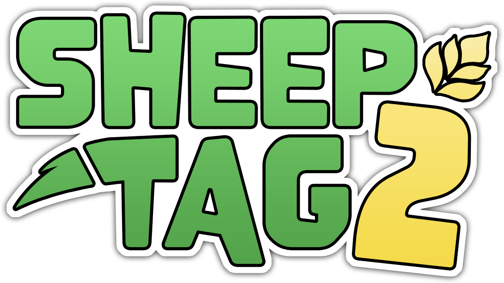

<p align="center">
  
</p>

<p align="center"><b>The classic cat-and-mouse game. Sheep vs. Wolves.</b><br>
A blend of real-time strategy and survival for up to 16 players online.</p>

<p align="center">
  <a href="https://store.steampowered.com/app/537680/Sheep_Tag_2"><b>Wishlist on Steam</b></a> &nbsp;|&nbsp;
  <a href="https://www.sheeptag2.com/">Website</a> &nbsp;|&nbsp;
  <a href="https://discord.gg/jNf5RsaZPp">Discord</a> &nbsp;|&nbsp;
  <a href="https://www.kickstarter.com/projects/lunawolfstudios/sheep-tag-2">Kickstarter</a>
</p>

---

## Overview

Source for the official [Sheep Tag 2](https://www.sheeptag2.com/) website and the community Terrain Content Library that it serves.

The site is a static [Astro](https://astro.build) build deployed to GitHub Pages on the custom domain `www.sheeptag2.com`. Everything the site publishes lives in this repository: the terrain archives, the farm data, the guide pages, and the press kit assets.

## Requirements

- Node.js 22 or newer (CI builds on 22)
- npm

## Getting started

```bash
npm ci
npm run dev
```

The dev server runs at `http://localhost:4321`.

## Scripts

| Command | What it does |
|---|---|
| `npm run dev` | Runs the prebuild generator, then starts the Astro dev server |
| `npm run build` | Runs the prebuild generator, then builds the static site into `dist/` |
| `npm run preview` | Serves the contents of `dist/` locally |
| `npm run check` | Runs the prebuild generator, then `astro check` for type and template diagnostics |

`scripts/build.mts` is the prebuild generator, wired to `predev` and `prebuild` so it always runs first. It performs four steps:

1. **Farms.** Parses `farms/descriptions.tsv`, joins each row to its icon, and writes `src/data/farms.json`.
2. **Terrains.** Reads the metadata out of every `.st2` archive in `terrains/`, verifies each content hash, writes `src/data/terrains.json`, extracts previews to `public/terrain-thumbs/`, and copies the archives to `public/terrains/`.
3. **Press kit.** Assembles the downloadable asset bundles into `public/press/`.
4. **Easter egg.** Copies `history/east.html` into `public/history/`.

All of its output is generated and gitignored. Delete it and rerun the generator at any time.

## Repository layout

| Path | Contents |
|---|---|
| `src/pages/` | Route files, including `guides/` for the guide pages |
| `src/components/` | Astro components |
| `src/layouts/` | Page layouts |
| `src/data/` | Site data. `links.ts` is the single source of truth for external URLs; `farms.json` and `terrains.json` are generated |
| `src/lib/` | Helpers, including `st2.ts` for reading and validating `.st2` archives |
| `src/styles/`, `src/scripts/` | Global CSS and client-side scripts |
| `terrains/` | Community terrain archives, the source of the Terrains page |
| `farms/` | `descriptions.tsv`, the source of the farm data |
| `art/`, `icons/`, `logos/`, `screenshots/`, `socials/` | Image sources |
| `history/` | Standalone history page assets |
| `public/` | Static assets copied verbatim, plus generated output |
| `scripts/build.mts` | Prebuild data generator |

## Terrains

A terrain is a map, saved by the game's built-in level editor as a single `.st2` file. A `.st2` is a compressed archive holding three files at its top level:

| File | Contents |
|---|---|
| `meta.json` | Name, author, version, description, tags, map size, tileset, preview image, and the content hash |
| `terrain.json` | Tile data |
| `scenery.json` | Scenery placement and spawn points |

Browse and download every community terrain on the [Terrains page](https://www.sheeptag2.com/terrains).

### Installing a downloaded terrain

Place the `.st2` file in the Sheep Tag 2 custom folder and it appears in-game.

| OS | Folder |
|---|---|
| Windows | `%USERPROFILE%\AppData\LocalLow\Luna Wolf Studios\Sheep Tag 2\Custom\` |
| macOS | `~/Library/Application Support/Luna Wolf Studios/Sheep Tag 2/Custom/` |
| Linux | `~/.config/unity3d/Luna Wolf Studios/Sheep Tag 2/Custom/` |

On Windows the `AppData` folder and on macOS the `Library` folder are hidden by default.

### Submitting a terrain

Two options, both covered in [CONTRIBUTING.md](CONTRIBUTING.md):

- **Submission form.** Use the [terrain submission form](https://www.sheeptag2.com/submit). No account is needed. The archive is validated in the browser (contents, metadata, preview image, map data) before it is sent for review.
- **Pull request.** Add the `.st2` file to `terrains/` and open a PR.

Requirements for acceptance:

- Fill in the name, author, version, and description in the level editor, and keep the map preview.
- Credit yourself as the author. The name is shown on the site.
- Save from the level editor. Every `.st2` carries a `ContentHash` stamped in by the editor. An archive that was unpacked, hand-edited, or rezipped fails validation in both the submission form and the site build.
- Submitting licenses the terrain under CC BY 4.0 (see [License](#license)).

## Guides

The [guide pages](https://www.sheeptag2.com/guides) cover farms, sheep, wolves, spells, potions, spirits, upgrades, abilities, resources and stats, day and night, and game modes. Farm entries are generated from `farms/descriptions.tsv`; the rest are authored in `src/pages/guides/`.

## Deployment

`.github/workflows/deploy.yml` builds and deploys to GitHub Pages on every push to `main`, and on manual dispatch. The workflow runs `npm ci` and `npm run build`, then uploads `dist/` as the Pages artifact. Repo setting: Settings > Pages > Build and deployment > Source: GitHub Actions. The `CNAME` file pins the custom domain.

`astro.config.mjs` also defines redirects (`/press` and `/press-kit` to `/presskit`, `/farms` to `/guides/farms`) and a sitemap filter that excludes the redirect aliases, the 404 page, and the easter egg.

## Official links

| | |
|---|---|
| Website | https://www.sheeptag2.com/ |
| Steam | https://store.steampowered.com/app/537680/Sheep_Tag_2 |
| Soundtrack | https://store.steampowered.com/app/2151350/Sheep_Tag_2_Original_Soundtrack |
| Kickstarter | https://www.kickstarter.com/projects/lunawolfstudios/sheep-tag-2 |
| Discord | https://discord.gg/jNf5RsaZPp |
| X | https://x.com/sheeptag2 |
| Bluesky | https://bsky.app/profile/lunawolfstudios.bsky.social |
| Facebook | https://facebook.com/sheeptag2 |
| Instagram | https://instagram.com/sheeptag2 |
| YouTube | https://www.youtube.com/channel/UCzw57oNyk0mCeVSoi-UCUBQ |
| Twitch | https://twitch.tv/directory/game/Sheep%20Tag%202 |
| IndieDB | https://www.indiedb.com/games/sheep-tag-2 |

## License

This repository contains two kinds of content under different licenses.

- **Community terrains**, the files in [`terrains/`](terrains/), are licensed under [Creative Commons Attribution 4.0](terrains/LICENSE). Use and remix them, with credit to the original author.
- **Everything else**, including the website source and all Sheep Tag 2 artwork, logos, icons, and branding, is copyright Luna Wolf Studios LLC, all rights reserved, and is not licensed for reuse.

---

<p align="center"><sub>Copyright 2015-2026 Luna Wolf Studios LLC. All rights reserved.</sub></p>
